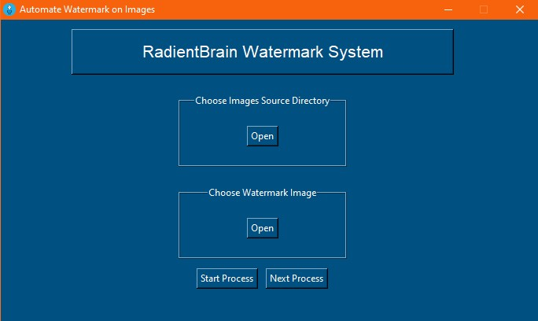

# Python Automation GUI
This is a Python Automation GUI that can be used to **Automate boring Photoshop work of applying the watermark** to thousands of images and complete the tasks in *few minutes* which could have taken hours instead!

## How to make use of this GUI:

Just download this <a href = "https://github.com/RadientBrain/Python-Automation-Projects/tree/master/Logo%20Paster"> **Logo Paster**</a> *folder* and put it in your desired location on the PC
* Then either create a shortcut of the <a href="https://github.com/RadientBrain/Python-Automation-Projects/blob/master/Logo%20Paster/main.exe"> **main.exe** </a> on your desktop or just run <a href="https://github.com/RadientBrain/Python-Automation-Projects/blob/master/Logo%20Paster/main.exe"> **this** </a> executable and start automating the watermarks
  * **Note:** The watermarks are applied in the center of the images and you can change the source code if you want to apply it somewhere else

**NOTE:**
* Before pressing next button transfer the modified files from the ***dst_photos* dir** to your preferred location
* This GUI is *only* tested for **Windows Operating System** so if you are using *any other **Operating System*** then this might not work
* Any issues with this can be posted in the *issue tracker* of this repository

***ENJOY!***
